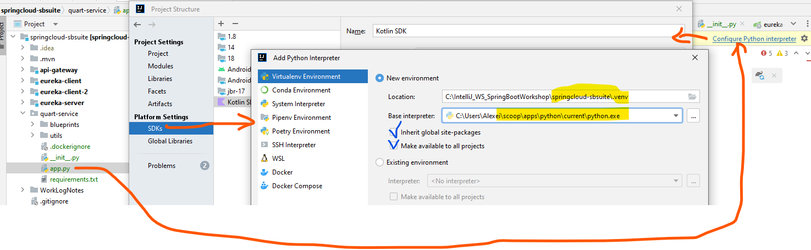

# Add Python Sdk to intelliJ
- google `intellij add python module in spring cloud project`
  - [Configure a Python SDK](https://www.jetbrains.com/help/idea/configuring-python-sdk.html)
    - expand `Create a virtualenv environment` section
    -
