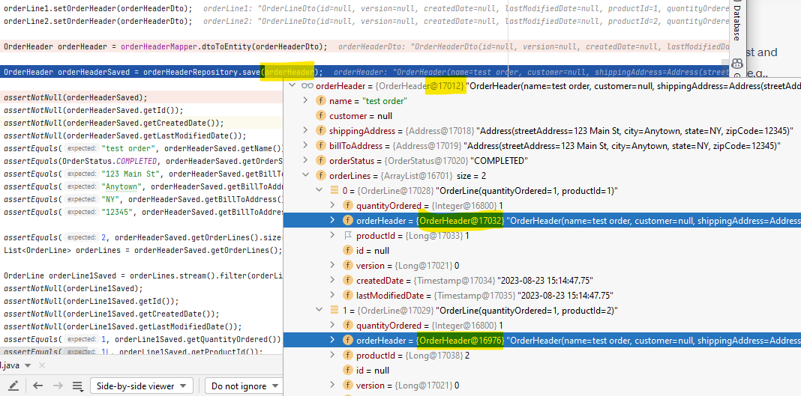

- Posted @ August 17, 2023 # [TransientPropertyValueException in Mapstruct created entities](https://stackoverflow.com/questions/76923224/transientpropertyvalueexception-in-mapstruct-created-entities)
## TransientPropertyValueException in Mapstruct created entities

Can anyone give a hint what can go wrong with saving two related entities to database.
The only problem is that these entities created out from data transfer objects with help of MapStruct.
Testcase where I save fresh entities to db works fine.
Testcase where I save entities created from Dtos to db fail.

Unit test create and save OrderHeader with 2  OrderLine to database - works with NO issues

```
public void testOrderHeaderRepository() {  
 	OrderLine orderLine1 = OrderLine.builder().quantityOrdered(1).productId(1L).build();  
	OrderLine orderLine2 = OrderLine.builder().quantityOrdered(1).productId(2L).build();  
	OrderHeader orderHeader = OrderHeader.builder().name("test order").build();  
	  
	orderHeader.setOrderLines(new HashSet<OrderLine>() {{  
	add(orderLine1);  
	add(orderLine2);  
	}});  
	orderLine1.setOrderHeader(orderHeader);  
	orderLine2.setOrderHeader(orderHeader);  
	  
	OrderHeader orderHeaderSaved = orderHeaderRepository.save(orderHeader);
}
```

Unit test create OrderHeaderDto and 2  OrderLineDto, convert them to OrderHeader with 2  OrderLine and  save  to database - throws exception

```
public void testOrderHeaderRepositoryWithDto() {  
  
OrderLineDto orderLine1 = OrderLineDto.builder().quantityOrdered(1).productId(1L).build();  
OrderLineDto orderLine2 = OrderLineDto.builder().quantityOrdered(1).productId(2L).build();  
OrderHeaderDto orderHeaderDto = OrderHeaderDto.builder().name("test order").build();  

orderHeaderDto.setOrderLines(new HashSet<OrderLineDto>() {{  
	add(orderLine1);  
	add(orderLine2);  
}});  
orderLine1.setOrderHeader(orderHeaderDto);  
orderLine2.setOrderHeader(orderHeaderDto);  
  
OrderHeader orderHeader = orderHeaderMapper.dtoToEntity(orderHeaderDto, new CycleAvoidingMappingContext());  
  
OrderHeader orderHeaderSaved = orderHeaderRepository.save(orderHeader);
```

throws exception

```
org.hibernate.TransientPropertyValueException: object references an unsaved transient instance - save the transient instance before flushing : com.springcloud.sbsuite.orders.domain.OrderLine.orderHeader -> com.springcloud.sbsuite.orders.domain.OrderHeader
```


Here are main classes involved
two entities classes OrderHeader and OrderLine

```
@Entity  
@Data  
@NoArgsConstructor  
@AllArgsConstructor  
@Builder
public class OrderHeader extends BaseEntity {  
  
private String name;  
  
@OneToMany(mappedBy = "orderHeader", cascade = CascadeType.ALL, fetch = FetchType.EAGER)  
@EqualsAndHashCode.Exclude // Exclude this field from hash code calculation  
private Set<OrderLine> orderLines = new HashSet<>();  
}


@Entity  
@Data  
@NoArgsConstructor  
@AllArgsConstructor  
@Builder  
public class OrderLine extends BaseEntity {  
  
private Integer quantityOrdered;  
  
@ToString.Exclude  
@ManyToOne  
@JoinColumn(name = "order_header_id") // Specifies the column name for the foreign key  
@EqualsAndHashCode.Exclude // Exclude this field from hash code calculation  
private OrderHeader orderHeader;  
  
private Long productId;  
  
}
```

With corresponding dto's

```
@Data  
@NoArgsConstructor  
@AllArgsConstructor  
@Builder  
public class OrderHeaderDto {  
  
// BaseEntity props omitted 

private String name;  
@EqualsAndHashCode.Exclude // Exclude this field from hash code calculation  
private Set<OrderLineDto> orderLines = new HashSet<>();  
}

@Data  
@NoArgsConstructor  
@AllArgsConstructor  
@Builder  
public class OrderLineDto {  
  
// BaseEntity props omitted 
  
@ToString.Exclude  
@EqualsAndHashCode.Exclude // Exclude this field from hash code calculation  
private OrderHeaderDto orderHeader;  

private Long productId;  
private Integer quantityOrdered;  
}
```

Both entity classes have their jpa repositories

```
public interface OrderHeaderRepository extends JpaRepository<OrderHeader, Long> {  
}
public interface OrderLineRepository extends JpaRepository<OrderLine, Long> {  
}
```

I use MapStruct to convert dto to entities 

```
@Mapper(uses = {DateMapper.class, OrderLineMapper.class, AddressMapper.class})
public interface OrderHeaderMapper {
	@Mapping(target = "orderLines", source = "orderLines")
	OrderHeader dtoToEntity(OrderHeaderDto orderHeaderDto, @Context CycleAvoidingMappingContext cycleAvoidingMappingContext);
	@InheritInverseConfiguration
	OrderHeaderDto entityToDto(OrderHeader orderHeader, @Context CycleAvoidingMappingContext cycleAvoidingMappingContext);
}

@Mapper(uses = {DateMapper.class})
public interface OrderLineMapper {
	@Mapping(target = "orderHeader", source = "orderHeader")
	OrderLine dtoToEntity(OrderLineDto orderLineDto, @Context CycleAvoidingMappingContext cycleAvoidingMappingContext);
	OrderLineDto entityToDto(OrderLine orderLine, @Context CycleAvoidingMappingContext cycleAvoidingMappingContext);
}
```

### Bug in OrderHeaderMapper
- DtoToEntity mapper produce new instances of OrderHeader which cause jpa OrderHeaderRepository::save(orderHeader) to fail
	- 


### Issue report
- https://github.com/mapstruct/mapstruct/issues/3363#issuecomment-1690659213

**Issue Title:** Incorrect Mapping Behavior with Lombok Builder and CycleAvoidingMappingContext

**Description:** I'm encountering an issue related to incorrect mapping behavior when using MapStruct in conjunction with Lombok's builder pattern and the `CycleAvoidingMappingContext`. This issue leads to unintended instances being created during the mapping process, resulting in incorrect relationships between entities.

**Hint** - If Entities and Dto have circular references mapper implementation inserts references to builder into CycleAvoidingMappingContext instead of reference to entity or dto. 

This issue caused an exception when attempting to save an entity to the database using Hibernate-based Spring JPA. The exception message is as follows:

javaCopy code

`org.springframework.dao.InvalidDataAccessApiUsageException: org.hibernate.TransientPropertyValueException: object references an unsaved transient instance - save the transient instance before flushing : com.springcloud.sbsuite.orders.domain.OrderLine.orderHeader -> com.springcloud.sbsuite.orders.domain.OrderHeader`

**Steps to Reproduce:**

1. Use Lombok to generate builder methods for entities (e.g., `OrderHeader` and `OrderLine`).
2. Configure MapStruct to use the `CycleAvoidingMappingContext` for preventing circular references.
3. Define a mapping between DTOs (e.g., `OrderHeaderDto` and `OrderLineDto`) and entities using MapStruct.
4. During the mapping process, observe that new instances of entities are created unexpectedly, resulting in incorrect relationships.

**Expected Behavior:** The mapping process should reuse existing instances of entities, ensuring that relationships are maintained correctly and no unintended instances are created.

**Actual Behavior:** Due to the interaction between Lombok's builder pattern, MapStruct, and the `CycleAvoidingMappingContext`, new instances of entities are created during the mapping process, causing incorrect relationships and unexpected behavior.

**Solution:** After investigation, I discovered that the issue is caused by using Lombok's `@Builder` annotation on entity and DTO classes. To resolve the problem, I removed the `@Builder` annotation from both the entity and DTO classes. By doing so, the mapping process no longer creates unintended instances, and the relationships between entities are maintained correctly.

**Environment:**

- MapStruct version: 1.5.2.Final
- Lombok version: 1.18.26

**Additional Information:**

- Code snippets showing the entity classes, DTOs, Mapper interfaces, and relevant configurations.
- Stack traces or error messages you've encountered.
- Any workarounds you've attempted or insights you've gained while troubleshooting.

**Note:** I've thoroughly tested this issue and confirmed that it's reproducible in my environment. I believe this issue is related to the interaction between Lombok's builder pattern, MapStruct, and the `CycleAvoidingMappingContext`.


## Title: Issue with Using @Named Qualifier for Custom Mapping Method in MapStruct
- posted [Issue with Using @Named Qualifier for Custom Mapping Method in MapStruct](https://stackoverflow.com/questions/76946521/issue-with-using-named-qualifier-for-custom-mapping-method-in-mapstruct)

**Question:** I'm using MapStruct for object-to-object mapping in my Java project, and I'm trying to use a custom conversion method with the `@Named` qualifier. However, I'm encountering a "No method found annotated with @Named#value" error and can't seem to resolve it. Here's a breakdown of the problem:

**Description:** I have a mapper interface named `OrderHeaderMapper` that's responsible for mapping between `OrderHeaderDto` and `OrderHeader` classes. In my `OrderHeaderMapper` interface, I'm trying to use a custom conversion method with the `@Named` qualifier to convert a collection field. Here's what my code looks like:

```
import org.mapstruct.Mapper;
import org.mapstruct.Mapping;
import org.mapstruct.Named;
import java.util.Set;
import java.util.HashSet;

@Mapper
public interface OrderHeaderMapper {

    @Mapping(target = "orderLines", source = "orderLines", qualifiedByName = "toHashSet")
    OrderHeader dtoToEntity(OrderHeaderDto orderHeaderDto, @Context CycleAvoidingMappingContext cycleAvoidingMappingContext);

    @Named("toHashSet")
    default Set<OrderLine> convertToHashSet(Set<OrderLine> set) {
        return new HashSet<>(set);
    }

    OrderHeaderDto entityToDto(OrderHeader orderHeader, @Context CycleAvoidingMappingContext cycleAvoidingMappingContext);
}

```

**Issue:** Despite following the correct usage of `@Named` qualifier and method naming, I'm still facing the "No method found annotated with @Named#value" error during compilation.